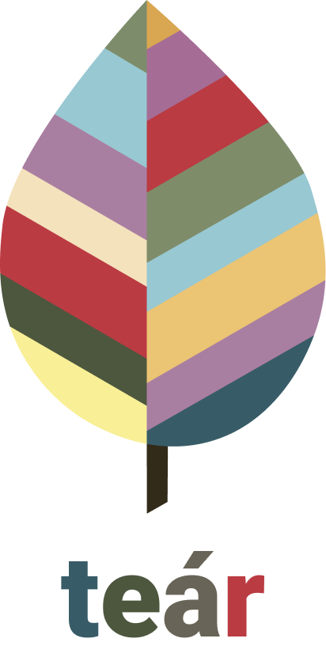

[![Contributors][contributors-shield]][contributors-url]
[![Commits][commits-shield]][commits-url]
[![Forks][forks-shield]][forks-url]
[![Stargazers][stars-shield]][stars-url]
[![Issues][issues-shield]][issues-url]

<!-- PROJECT LOGO -->
<br />
<p align="center">
  <a href="https://github.com/pmrmoura/Tear">
    
  </a>

  <h3 align="center">Tear</h3>

  <p align="center">
    An awesome iOS simulation game
    <br />
    <a href="https://github.com/pmrmoura/Tear"><strong>Explore the docs »</strong></a>
    <br />
    <br />
    <a href="https://github.com/pmrmoura/Tear">TestFlight(soon)</a>
    ·
    <a href="https://github.com/pmrmoura/Tear/issues">Report Bug</a>
    ·
    <a href="https://github.com/pmrmoura/Tear/issues">Request Feature</a>
  </p>
</p>


<!-- TABLE OF CONTENTS -->
## Table of Contents

* [About the Project](#about-the-project)
  * [Built With](#built-with)
* [Contributing](#git-flow)
  * [Add new feature or fix a bug](#add-new-feature-or-fix-a-bug)
  * [Pull Request Template](#pull-request-template)


<!-- ABOUT THE PROJECT -->
## About The Project

Fill with details about how great Tear is

### Built With
This section should list any major frameworks that you built your project using. Leave any add-ons/plugins for the acknowledgements section. Here are a few examples.
* [Swift](https://getbootstrap.com)
* [SceneKit](https://getbootstrap.com)

<!-- Git Flow -->
## Git Flow

### Add new Feature or fix a Bug

1. Create your Feature or Fix Branch
  * `git checkout -b feature/AmazingFeature`
  * `git checkout -b fix/AmazingFix`
2. Commit your Changes (`git commit -m 'Add some AmazingFeature'`)
  * `git commit -m 'Feature(AmazingFeature): Add some AmazingFeature`
  * `git commit -m 'Fix(AmazingFix): Fixes a bug`
3. Push to the Branch
  * `git push origin feature/AmazingFeature`
  * `git push origin fix/AmazingFix`
4. Open a Pull Request in Github's Pull request tab and fill it with the above Pull Request Template.
5. If the Pull Request is not able to merge automatically do the following steps while on your branch:
```sh
git pull develop
```
6. Solves conflicts in Xcode, and commit your changes
7. Add reviewers to your Pull Request and wait for approval.

## Pull Request Template
```sh
### Issue Name
**What I did:**

- First thing I did...

- Second thing I did...

**How to test:**

- Brief notes on how to check if the feature works correctly.
```

<!-- MARKDOWN LINKS & IMAGES -->
<!-- https://www.markdownguide.org/basic-syntax/#reference-style-links -->
[contributors-shield]: https://img.shields.io/github/contributors/pmrmoura/Tear.svg?style=flat-square
[contributors-url]: https://github.com/pmrmoura/Tear/graphs/contributors

[forks-shield]: https://img.shields.io/github/forks/pmrmoura/Tear.svg?style=flat-square
[forks-url]: https://github.com/pmrmoura/Tear/network/members
[commits-shield]: https://img.shields.io/github/last-commit/pmrmoura/Tear.svg?style=flat-square
[commits-url]: https://img.shields.io/github/last-commit/pmrmoura/Tear
[stars-shield]: https://img.shields.io/github/stars/pmrmoura/Tear.svg?style=flat-square
[stars-url]: https://github.com/pmrmoura/Tear/stargazers
[issues-shield]: https://img.shields.io/github/issues/pmrmoura/Tear.svg?style=flat-square
[issues-url]: https://github.com/pmrmoura/Tear/issues
[product-screenshot]: images/screenshot.png
